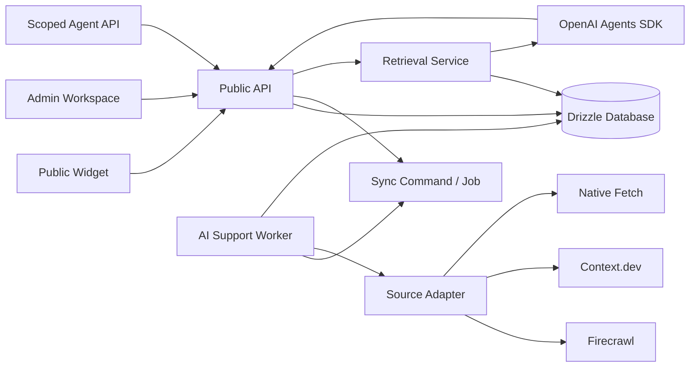

# ADR-001: AI Support Runtime And Operations Architecture

**Status:** Accepted

**Date:** 2026-07-10

**Deciders:** Product owner and engineering

## Context

The AI Support workspace must operate as a durable support product, not as a set of page-specific API handlers. A chatbot has knowledge sources, versioned behavior settings, public widget conversations, leads, human escalations, and scoped automation agents.

The current codebase already has the primary entities and synchronous APIs. It also has three source fetch choices: built-in fetch, Firecrawl, and Context.dev; answers are generated with the OpenAI Agents SDK after retrieval. The missing system boundary is a durable asynchronous runtime for scheduled sync, retries, and observable execution. Calling providers directly from individual HTTP routes makes scheduled work, retries, idempotency, and recovery unreliable.

## Decision

Keep the existing TanStack Start application and Drizzle database as the system of record. Add one database-backed AI Support runtime with a worker process. Do not introduce Kafka, a vector database, or a separate microservice in P2.

The runtime owns all asynchronous source ingestion and outbound notification retries. HTTP routes only validate access, create commands, and return current state. The worker claims due jobs with a lease, fetches through a provider adapter, creates chunks, and writes an immutable run record plus audit event.



## Requirements

### Functional

- A source is owned by exactly one chatbot and one account.
- Custom responses are deterministic and always precede generated answers.
- Text snippets, files, and website links become immutable chunk revisions before they are answerable.
- Website sources may select `native`, `firecrawl`, or `context_dev`, with `scrape` or `crawl` mode.
- A scheduled job can be enabled, paused, manually triggered, retried, and inspected.
- The widget receives cited answers, creates leads/escalations, and receives approved human replies.
- Automation agents may read, classify, propose, and draft. They cannot publish, delete, or send an external reply without an approval record.

### Non-functional

- Public widget response target: p95 below 8 seconds when an LLM call is configured; graceful deterministic fallback when it is not.
- Source sync must be idempotent per source revision and safe to retry.
- A provider failure must not lose the last ready knowledge revision.
- The public widget must not reach private networks through native crawling.
- Secrets remain server-side and are encrypted when stored in the existing configuration table.

## Component Boundaries

| Component | Responsibility | Must not do |
|---|---|---|
| Public/API routes | Authenticate, validate input, enqueue commands, return views | Fetch or crawl synchronously once the worker exists |
| Source adapter | Validate public URL, call one provider, normalize Markdown | Write database state or decide permissions |
| Sync runtime | Lease jobs, retry with backoff, persist revisions/chunks/run events | Generate visitor answers |
| Retrieval service | Custom-response match, lexical chunk ranking, citation selection | Fetch websites or mutate sources |
| Answer agent | Turn bounded approved context into customer-facing text | Access DB, crawl web, send messages, or change settings |
| Approval service | Validate human approval for publish/delete/external send | Execute unapproved agent output |
| Human support queue | Assignment, draft review, send approved support reply | Let agents send directly |

## Data Model

Existing tables remain the source of truth: `ai_knowledge_source`, `ai_knowledge_chunk`, `ai_knowledge_sync_job`, `ai_conversation`, `ai_conversation_message`, `ai_lead`, `ai_human_escalation`, `ai_agent_token`, `ai_agent_run`, `ai_config_version`, and `ai_audit_log`.

Add these P2 runtime fields/tables in the next migration:

| Entity | Required fields | Reason |
|---|---|---|
| `ai_knowledge_revision` | `id`, `source_id`, `content_hash`, `content`, `provider`, `page_count`, `status`, `created_at` | Preserve last ready revision and enable idempotency |
| `ai_sync_run` | `id`, `job_id`, `source_id`, `status`, `attempt`, `lease_until`, `started_at`, `finished_at`, `error`, `metrics` | Durable execution history and lease ownership |
| `ai_approval` | `id`, `kind`, `resource_id`, `requested_by`, `approved_by`, `status`, `expires_at` | Enforce human approval for external effects |
| `ai_outbox_event` | `id`, `type`, `payload`, `dedupe_key`, `status`, `available_at`, `attempts` | Deliver notifications and webhooks reliably |

`ai_knowledge_source.status` remains a user-facing summary: `draft`, `indexing`, `ready`, `needs_review`, `archived`. `ai_sync_run.status` is operational: `queued`, `leased`, `running`, `succeeded`, `failed`, `cancelled`.

## State Machines

### Knowledge source

```text
draft -> indexing -> ready
                 -> needs_review
ready -> indexing -> ready
ready -> archived
needs_review -> indexing -> ready
```

Only a successful revision may replace the source's active revision and chunks. On failure, retain the prior ready chunks and set the source summary to `needs_review` with the newest failure reason.

### Sync run

```text
queued -> leased -> running -> succeeded
                         -> failed -> queued (backoff, if retryable)
queued -> cancelled
leased -> queued (lease expiry recovery)
```

The dedupe key is `source_id + requested_revision_or_updated_at`. A worker must atomically claim a run only when `lease_until < now` or the run is queued. Maximum retry count is five, with exponential backoff and jitter. Non-retryable failures include invalid URL, disabled provider, invalid credentials, and unsupported file type.

### External actions

```text
agent proposal -> pending_approval -> approved -> executed
                                  -> rejected | expired
```

`reply.send`, source deletion, source publication, and configuration publication always require an approved `ai_approval` record. The current UI's direct human support send is a human action and is audited; no Agent API may call it.

## Data Flows

### Source ingestion

1. Admin or scoped agent creates/updates a source. Agent changes are proposals by default.
2. The API validates chatbot ownership and stores source metadata, including provider and mode.
3. The API upserts a sync job and emits a deduplicated `source.sync.requested` outbox event.
4. The worker claims the due job with a lease.
5. The adapter validates URL policy, calls the selected provider, normalizes Markdown, and enforces page/content limits.
6. The worker writes a new revision, replaces active chunks transactionally, marks the source ready, and records `ai_sync_run` plus audit log.
7. On failure it preserves the old active revision, records the provider error, and schedules retry when appropriate.

### Widget answer

1. Public route validates widget origin, public key, and request size/rate limit.
2. Retrieval checks active custom responses for a deterministic match.
3. If no custom response matches, retrieval selects bounded chunks from the active revisions only.
4. The answer agent receives the question, policy/persona, and delimited reference text. It has no database, network, or write tools.
5. The response stores citations as source/revision identifiers. The widget displays citations and escalation CTA according to published configuration.
6. Empty context, missing OpenAI configuration, timeout, or model failure returns the deterministic support fallback; it must not hallucinate.

### Human support

1. Widget escalation creates an escalation with conversation snapshot, contact fields, source URL, and message references.
2. Notification is written to the outbox; it is never sent inline with the widget request.
3. A human may assign, annotate, close, or reply. A support reply writes a conversation message and audit event.
4. An agent can summarize/classify/draft only. A human approval is required before a draft becomes a support reply.

## API Contract Rules

- Every admin API verifies session and chatbot ownership.
- Every agent API verifies token hash, expiry, enabled status, chatbot scope, and action scope.
- Public widget APIs use public key plus allowed-origin checks and a per-widget/per-visitor rate limit.
- Mutation responses return the new resource state and a stable ID. They do not expose provider credentials or decrypted config values.
- Sync requests return a command/run ID, not provider output. A `GET /api/ai-support/sync-runs?sourceId=` endpoint provides progress.

## Deployment And Operations

Run the web server and worker as separate process roles using the same application image and database configuration.

```text
web:     pnpm start
worker:  pnpm ai-support:worker
```

For a single-instance deployment, run one worker. For multiple replicas, use database leases and unique dedupe keys; workers may scale horizontally without duplicate processing. Do not use in-memory timers as the primary scheduler, because deploys and restarts lose due work.

Required metrics:

- sync queue depth, oldest due job age, worker lease recovery count
- provider success rate, latency, pages/content per run, failure reason cardinality
- retrieval hit rate, custom-response hit rate, fallback rate, citation count
- widget response latency and escalation rate
- approval queue age and external delivery failures

Alert when no worker heartbeat is seen for five minutes, the oldest due job exceeds fifteen minutes, provider failures exceed 20% for fifteen minutes, or fallback rate spikes above the configured baseline.

## Options Considered

### Database-backed runtime

| Dimension | Assessment |
|---|---|
| Complexity | Medium |
| Cost | Low |
| Scaling | Adequate for P2 |
| Operational fit | Strong with current Drizzle schema |

Pros: one transactional source of truth, auditable, retryable, no new infrastructure.

Cons: polling worker and database indexes need care at high scale.

### Managed queue plus separate workers

| Dimension | Assessment |
|---|---|
| Complexity | High |
| Cost | Medium |
| Scaling | High |
| Operational fit | Premature for P2 |

Pros: better burst handling and long-running crawl isolation.

Cons: new failure modes, duplicate-event reconciliation, added operations burden.

### Direct synchronous HTTP fetching

| Dimension | Assessment |
|---|---|
| Complexity | Low initially |
| Cost | Low |
| Scaling | Poor |
| Operational fit | Rejected |

Pros: minimal code.

Cons: request timeouts, no durable retries, no scheduler, poor observability, provider work tied to user request lifetime.

## Consequences

- P2 stays deployable as a modular monolith and preserves the existing database model.
- Scheduled sync and notification delivery become reliable across restarts.
- Source providers are replaceable without changing retrieval or widget APIs.
- OpenAI Agents SDK remains bounded to answer synthesis; this prevents a prompt-injected source from gaining operational access.
- P3 may add embeddings/vector retrieval behind the retrieval service without rewriting ingestion or the widget contract.

## Implementation Order

1. Add runtime migration: revisions, sync runs, approvals, outbox events, indexes.
2. Implement worker claim/lease, retry policy, and health endpoint.
3. Change current synchronous website sync routes into command creation; leave manual "run now" as a high-priority command.
4. Persist provider result metadata and active revision IDs; maintain current chunks as the active projection.
5. Add source/run detail APIs and UI status/log views.
6. Add `ai_approval` checks to all agent publish/delete/external-send paths.
7. Add widget rate limits, retrieval metrics, provider circuit breakers, and end-to-end tests.

## Revisit At Scale

Revisit the runtime when the workload exceeds roughly 100 concurrent source runs or 10,000 active chunks per chatbot. At that point, move the outbox consumer to a managed queue and add vector retrieval as a separate index projection. Preserve source revisions, sync runs, approval records, and public API contracts during that evolution.
