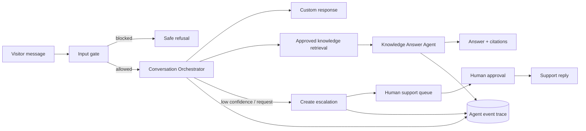

# ADR-002: Customer Support Agent Orchestration And Safety Boundary

**Status:** Accepted

**Date:** 2026-07-10

**Deciders:** Product owner and engineering

## Context

The OpenAI Customer Service Agents demo is a useful reference for conversational orchestration. It uses a Triage Agent, domain specialists, function tools, structured conversation context, input guardrails, and an event stream that visualizes handoffs and tool calls.

Our product differs in important ways. It is a multi-tenant knowledge-base and support platform, not one airline workflow. It must protect each chatbot's data, preserve an audit trail, and let Codex/Hermes-like operational agents maintain knowledge without allowing them to publish, delete, or contact customers autonomously.

The existing answer path uses the OpenAI Agents SDK only as a direct synthesis call. It has no persisted agent trace, conversation-scoped tool contract, or typed approval gate. The existing generic agent API is separate from public visitor conversation execution.

## Decision

Adopt the demo's orchestration concepts, but not its topology verbatim.

P2 uses one **Conversation Orchestrator** per public message. The orchestrator selects an explicit, typed capability path instead of allowing arbitrary multi-agent handoffs:

- `knowledge_answer`: retrieve approved revisions and produce a cited answer.
- `support_triage`: classify unresolved/unsafe/low-confidence requests and offer escalation.
- `human_reply`: deliver only a human-approved support reply; never callable by the model or automation token.

Domain specialist agents and free-form handoffs are deferred until a customer has product-specific operational tools with stable schemas. When introduced, each specialist must be a capability owner with an allowlisted tool set and a declared approval policy.



## What We Adopt From The Demo

| Demo pattern | Production adaptation |
|---|---|
| Triage Agent routes to experts | Deterministic orchestrator routes to named capabilities; model handoff is reserved for future domain specialists |
| Per-agent tool allowlists | Capability-scoped server tools with chatbot ownership and approval policy checks |
| Structured runtime context | Persistent conversation context split into private and public projections |
| Relevance and jailbreak guardrails | Deterministic input limits plus narrow model guardrails; never rely solely on a prompt |
| Run/tool/handoff event visualization | Immutable agent event trace, streamed to authorized admin views only |
| In-memory thread store | Existing database conversations/messages/context; no customer state in process memory |

## What We Do Not Adopt

- Do not use process-local memory for threads, context, or listener state. It loses data on restart and cannot scale horizontally.
- Do not let a model call mutation tools that change customer state directly. The demo's seat/rebooking/compensation tools are intentionally autonomous for a mock environment; our production equivalent must create a proposed operation or require approval.
- Do not expose internal context, tool output, guardrail reasoning, or agent topology to the public widget.
- Do not create one specialist agent per navigation page. A specialist only exists when it owns a coherent capability and narrow tool set.

## Conversation Context Contract

Add `ai_conversation_context` with one row per conversation:

| Field | Visibility | Purpose |
|---|---|---|
| `conversation_id` | Internal | Primary key and ownership join |
| `chatbot_id`, `user_id` | Internal | Tenant boundary |
| `public_context` | Admin + visitor-safe subset | Locale, provided contact name, current topic, latest cited source titles |
| `private_context` | Internal only | Lead IDs, escalation IDs, confidence, source revision IDs, risk labels, provider run IDs |
| `current_capability` | Internal | `knowledge_answer`, `support_triage`, or `human_reply` |
| `context_version` | Internal | Allows safe schema evolution |
| `updated_at` | Internal | Optimistic update/concurrency control |

Only the server creates or changes private context. The visitor may supply identity and metadata, but those values are stored as untrusted attributes and never treated as authorization or tool input without validation.

## Capability And Tool Policy

| Capability | Allowed reads | Allowed writes | Approval |
|---|---|---|---|
| `knowledge_answer` | Active custom responses, active revisions/chunks, published prompt/persona | Conversation/message/trace only | None |
| `support_triage` | Conversation, human-support settings | Escalation draft, knowledge-gap draft, trace | Human approves any customer-visible follow-up |
| `human_reply` | Escalation and full transcript | Support message | Human session required |
| `ops_knowledge` | Source/job/run health | Proposed source changes and sync commands | Publish/delete requires approval |
| `ops_lead` | Leads and conversations in scope | Classification and internal notes | External send unavailable |

The OpenAI Agents SDK agent receives only a capability-specific tool list. It never receives a general database tool, HTTP fetch tool, shell tool, or admin API token.

## Guardrails

Guardrails run in this order:

1. **Deterministic request gate:** body length, content type, rate limit, allowed origin, public key, tenant ownership.
2. **Intent and relevance classifier:** detects requests outside the chatbot's configured scope; returns an escalation/fallback decision, not a free-text prompt injection explanation.
3. **Prompt-injection classifier:** evaluates the latest visitor message and retrieved source content separately. A flagged source is excluded from answer context and marked for review.
4. **Tool policy validator:** validates typed arguments, chatbot scope, and approval state server-side after model selection.
5. **Output gate:** removes secrets/internal identifiers, verifies citations reference selected revisions, and applies maximum length/locale policy.

Guardrail decisions must be stored as events with `passed`, `policy`, and a short internal reason. The widget receives only a safe refusal or escalation prompt.

## Trace And Observability

Add immutable `ai_agent_event` records:

| Field | Meaning |
|---|---|
| `id`, `conversation_id`, `agent_run_id` | Correlation identifiers |
| `sequence`, `event_type` | Ordered event stream: `gate`, `route`, `retrieval`, `tool_call`, `tool_result`, `handoff`, `approval`, `output` |
| `capability`, `actor_type`, `actor_id` | Who/what produced the event |
| `safe_metadata` | IDs, duration, result counts, policy status; no secret or full private prompt |
| `created_at` | Ordering and latency analysis |

The admin console may subscribe to an SSE endpoint for a conversation's authorized trace. The visitor widget receives neither raw trace nor model/tool reasoning. Persist events first, then publish them through the outbox/runtime from ADR-001 so reconnects can rebuild the trace.

## Handoff Rules

An orchestrator may change capability at most once per visitor message. This preserves a comprehensible trace and avoids loops.

```text
knowledge_answer -> support_triage     only when no approved answer / low confidence
support_triage   -> human_reply        only after a human accepts the case and writes a reply
human_reply      -> knowledge_answer   next visitor message starts a new routing decision
```

Future domain-specialist handoffs must include a typed context transfer and a maximum turn budget. A specialist may never invoke itself or its direct caller.

## API Additions

- `POST /api/ai-support/conversations/:id/respond`: creates an orchestrator run for an authenticated internal test/preview flow.
- `GET /api/ai-support/conversations/:id/trace`: admin-only persisted trace.
- `GET /api/ai-support/conversations/:id/trace/stream`: admin-only SSE deltas.
- `POST /api/ai-support/approvals/:id/approve|reject`: explicit approval transition.
- `POST /api/ai-support/escalations/:id/reply`: human-only reply execution.

Public widget endpoints remain narrow: submit message, submit lead, request escalation, fetch approved support replies. They never expose orchestration internals.

## Reliability And Cost Controls

- Limit public conversation orchestration to one active run per conversation using a short database lease.
- Set a maximum of two model turns for `knowledge_answer` and one for `support_triage`.
- Cache retrieval results by `chatbot_id + active_revision_set + normalized_query` for a short TTL; do not cache answers across visitor identities.
- Record model/provider latency and token estimates in trace metadata for later usage enforcement.
- On model timeout/error, use the deterministic cited fallback and create a knowledge-gap candidate if retrieval confidence is low.

## Consequences

- We retain the clarity of the OpenAI demo's orchestration while keeping P2 a modular monolith.
- The user can inspect why an answer escalated without exposing reasoning to a visitor.
- Adding a future sales, billing, or technical-support specialist becomes an explicit capability change rather than an uncontrolled prompt expansion.
- The design introduces three new persistence concepts: conversation context, agent events, and approvals. They should be included with the worker/outbox migration from ADR-001.

## Action Items

1. Add `ai_conversation_context`, `ai_agent_event`, and `ai_approval` to the production migration alongside ADR-001 runtime tables.
2. Extract the current direct answer call into `ConversationOrchestrator.respond()` and emit trace events.
3. Add deterministic and model guardrails before retrieval and before output delivery.
4. Convert agent draft records into approval records before any future publish/delete/send execution.
5. Build the admin trace panel only after the persisted trace API exists; do not build a process-local visualizer.
6. Add end-to-end tests for prompt injection, irrelevant requests, forced fallback, human escalation, rejected approval, and cross-chatbot trace access.
