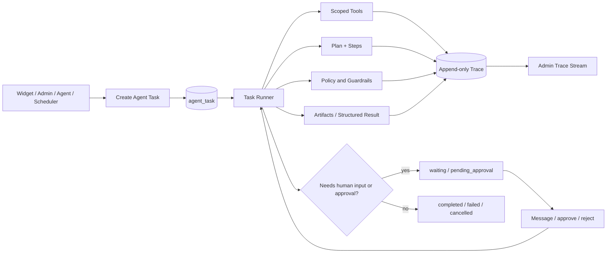

# ADR-003: Manus-Style Agent Task Runtime And Complete Trace

**Status:** Accepted

**Date:** 2026-07-10

**Deciders:** Product owner and engineering

**Supersedes:** The task/run, trace, and approval portions of ADR-001 and ADR-002. Their source-runtime and capability-boundary decisions remain valid.

## Context

The product will be operated by people and long-running Codex/Hermes-style agents. A final answer, audit row, or generic `ai_agent_run` record is not enough to understand an action, recover after a failure, approve a pending operation, or review an incident.

The required model is a Manus-style asynchronous task runtime: a task persists independently of any HTTP connection, exposes a chronological event stream, holds a mutable plan, can pause for human input or approval, and records outputs/artifacts. Manus documents this as a task lifecycle with verbose events for plan updates, new plan steps, tool usage, explanations, status updates, errors, and structured outputs.

Our support system adds multi-tenant boundaries, private customer data, public widget requests, source-sync workers, and approval-required external actions. Therefore the trace must be complete for authorized review, durable across restarts, and safe by default.

## Decision

Make `agent_task` the canonical execution unit for all agentic work:

- visitor answer orchestration;
- knowledge source sync and re-indexing;
- agent-proposed knowledge maintenance;
- lead/conversation classification;
- escalation summaries and reply drafts;
- human approval/external-reply execution;
- scheduled operational checks.

Every task has an append-only event ledger, a versioned plan, step state, artifacts, an approval/wait state, and a final structured result. The system never stores raw private chain-of-thought. Instead, it stores concise, policy-reviewed execution explanations and structured decision records.



## Task Lifecycle

```text
queued -> leased -> running -> completed
                    |          -> cancelled
                    |          -> failed
                    -> waiting_input -> queued
                    -> pending_approval -> queued
                    -> retry_wait -> queued
leased -> queued               (lease expires or worker dies)
```

Terminal states are `completed`, `failed`, and `cancelled`. `waiting_input` and `pending_approval` are intentional pauses, not failures. A task may be resumed only by a permitted actor and records that actor's message or approval as a trace event.

## Data Model

All records include `id`, `user_id`, `chatbot_id` where applicable, timestamps, and tenant ownership indexes. Use a production migration; never rely on `db:push` for this runtime.

### `ai_agent_task`

| Field | Description |
|---|---|
| `id`, `parent_task_id`, `root_task_id` | Supports nested work while preserving one root timeline |
| `kind` | `widget_answer`, `source_sync`, `ops_knowledge`, `lead_triage`, `reply_draft`, `reply_send`, `health_check` |
| `status`, `priority` | Lifecycle and scheduling priority |
| `requester_type`, `requester_id` | `visitor`, `user`, `agent_token`, `scheduler`, `system` |
| `conversation_id`, `source_id`, `escalation_id` | Optional domain links |
| `capability` | Capability selected by the orchestrator |
| `input_ref`, `context_snapshot_ref` | Encrypted/blob references; not duplicated unbounded in events |
| `plan_version`, `next_sequence` | Optimistic plan updates and ordered event allocation |
| `lease_owner`, `lease_until`, `attempt`, `max_attempts` | Crash recovery and retry control |
| `result_status`, `result_ref`, `error_code` | Final structured output/error |
| `started_at`, `finished_at`, `expires_at` | Timing and retention |

### `ai_agent_plan` And `ai_agent_plan_step`

`ai_agent_plan` stores a full immutable plan snapshot for each `version`. `ai_agent_plan_step` stores stable step IDs with `title`, `kind`, `status`, `depends_on`, `started_at`, `finished_at`, `attempt`, and `result_summary`.

Step status is exactly: `todo`, `doing`, `waiting`, `done`, `failed`, `skipped`, `cancelled`. The runner may add steps, but cannot remove completed history. A plan mutation emits both `plan_updated` and individual step events.

### `ai_agent_trace_event`

This is the authoritative chronological ledger. The unique key is `(task_id, sequence)`; sequence is allocated transactionally from `ai_agent_task.next_sequence`.

| Field | Description |
|---|---|
| `event_type` | See full event taxonomy below |
| `step_id`, `attempt` | Optional plan linkage |
| `actor_type`, `actor_id` | User, visitor, model, worker, tool, agent token, system |
| `visibility` | `public_summary`, `tenant_admin`, `operator`, `system_only` |
| `summary` | Short redacted explanation safe for the selected visibility |
| `payload_ref`, `payload_hash` | Encrypted detailed payload/artifact reference and integrity check |
| `duration_ms`, `usage_json` | Latency, provider/model usage and cost estimate |
| `created_at` | Ordering and timeline display |

### `ai_agent_artifact`

Stores durable outputs such as a normalized crawl result, generated report, structured answer, export, or attachment. Fields: `task_id`, `event_id`, `type`, `name`, `content_type`, `storage_key`, `content_hash`, `byte_size`, `visibility`, `metadata`.

### `ai_agent_approval`

Stores an approval request rather than putting approval status only in a task. Fields: `task_id`, `event_id`, `kind`, `requested_action`, `requested_payload_ref`, `status`, `requested_by`, `approved_by`, `reason`, `expires_at`, `decided_at`.

An approved action gets a new execution task or a resumed task; approval never executes arbitrary serialized code.

## Complete Event Taxonomy

Every lifecycle transition and material action must write one event. This is the minimum complete trace.

| Phase | Event types |
|---|---|
| Task creation | `task_created`, `input_received`, `context_snapshot_created`, `task_queued` |
| Scheduling | `task_leased`, `lease_renewed`, `lease_expired`, `task_retried`, `task_cancel_requested` |
| Plan | `plan_created`, `plan_updated`, `plan_step_created`, `plan_step_started`, `plan_step_waiting`, `plan_step_completed`, `plan_step_failed`, `plan_step_skipped` |
| Reasoned execution | `capability_selected`, `execution_explanation`, `handoff_requested`, `handoff_completed` |
| Guardrails | `guardrail_started`, `guardrail_passed`, `guardrail_blocked`, `content_redacted` |
| Retrieval | `retrieval_started`, `retrieval_completed`, `citation_selected`, `knowledge_gap_detected` |
| Tools | `tool_call_requested`, `tool_call_validated`, `tool_call_started`, `tool_call_completed`, `tool_call_failed`, `tool_call_blocked` |
| Approval/input | `approval_requested`, `approval_granted`, `approval_rejected`, `input_requested`, `input_received`, `task_resumed` |
| Output | `artifact_created`, `structured_output_created`, `response_drafted`, `response_delivered` |
| Termination | `task_completed`, `task_failed`, `task_cancelled`, `task_expired` |

`execution_explanation` is a short operational summary such as “No exact FAQ matched; searched approved billing sources and found two citations.” It must not capture raw hidden reasoning or unreduced model scratchpad.

## Visibility, Privacy, And Redaction

The trace is complete for authorized review, not universally visible.

| Audience | May view |
|---|---|
| Visitor | Final answer, citations, escalation status, approved human replies |
| Tenant support/admin | Task status, plan, safe event summaries, citations, artifacts explicitly shared with tenant |
| Tenant owner | Above plus approval decisions and redacted tool details for their chatbot |
| Platform operator | System diagnostics and encrypted payload access under break-glass audit |
| Automation agent | Only task data within its token's chatbot scope and explicit read scope |

Rules:

- Raw customer messages, source content, tool parameters, and tool output are stored once as encrypted payload/artifact references. Event summaries are redacted.
- Secrets, access tokens, cookie values, authorization headers, and full provider prompts are never written to trace payloads.
- Every trace read emits `trace_viewed` with actor and purpose.
- The public API cannot request `verbose` trace. Admin APIs must paginate by opaque cursor and enforce chatbot ownership.
- Retention is policy-driven: safe event summaries are retained longer than encrypted raw payloads; deletion creates a tombstone event rather than rewriting event sequence.

## Execution Contracts

### Task creation

`POST /api/ai-support/tasks`

Creates an asynchronous task for admin/agent workflows. The service validates token/session, chatbot scope, task kind, idempotency key, and initial capability. It returns `{ taskId, status, traceUrl }` immediately.

### Visitor message

The widget message API creates a `widget_answer` task and waits only up to the configured short deadline. If completed, return the response. If it exceeds the deadline, return a stable pending response, persist the task, and deliver the final answer only through the allowed conversation channel. Do not leave an HTTP request holding a long-running agent task.

### Trace retrieval

`GET /api/ai-support/tasks/:id/events?cursor=&limit=50&view=admin`

Returns chronological cursor-pagination. `GET /api/ai-support/tasks/:id/stream` emits persisted events after the caller's cursor; SSE reconnects never depend on process memory.

### Human interaction

`POST /api/ai-support/tasks/:id/messages` provides requested information. `POST /api/ai-support/approvals/:id/approve|reject` transitions only the matching approval. Both events are appended before the task resumes.

## Orchestrator Rules

1. One task owns one root goal and one tenant/chatbot boundary.
2. One plan step owns one capability or one tool intent.
3. The model may propose a plan/tool call; the server validates scope, schemas, idempotency, rate limit, and approval before execution.
4. No task may execute more than one external side effect without a distinct approval or an explicit pre-authorized policy.
5. Handoffs are task-child creation or capability changes, not invisible prompt jumps. Each has a trace event and parent/child relation.
6. A worker restart can resume from the last persisted successful step or retry safe idempotent work; it cannot replay a completed external effect.

## Runtime Modes

| Mode | Examples | Planning | Trace | SLA |
|---|---|---|---|---|
| Inline conversational | Widget answer, FAQ | Small implicit plan, max two model turns | Full persisted trace; visitor sees final response only | p95 < 8s |
| Async operational | Source sync, knowledge maintenance, lead triage | Explicit versioned plan | Full trace and SSE | Background |
| Approval-gated | Send reply, publish source, delete source | Explicit plan with waiting step | Full trace plus approval record | Pauses safely |
| Scheduled | Health checks, recurring sync | System-generated plan | Full trace with scheduler requester | Background |

## Migration From Current Implementation

1. Keep `ai_agent_run` as a compatibility view; write new task IDs into its metadata during transition.
2. Add runtime tables in one reviewed Drizzle migration with indexes on `(user_id, chatbot_id, status)`, `(task_id, sequence)`, and due lease fields.
3. Wrap `runConfiguredKnowledgeSync` in a `source_sync` task before moving actual provider work to the worker.
4. Wrap `generateAnswerWithAgent` in `widget_answer` and emit retrieval/output events.
5. Convert existing pending agent drafts to `ai_agent_approval` records; preserve existing audit logs as historical events.
6. Replace any process-local live listener with DB-backed cursor/SSE fanout.
7. Add admin Task Center before exposing general agent automation controls.

## Operational Limits And Reliability

- Lease duration: 60 seconds; renew every 20 seconds while a task is running.
- Maximum active task per visitor conversation: 1. Use a short lease to prevent duplicate answers.
- Retry only idempotent tasks. External sends and publication use an idempotency key plus an approval/execution record.
- Event writes are append-only and transactionally coupled with state transitions.
- Backpressure when queue age or provider error rate breaches threshold: pause low-priority scheduled tasks first, preserve human-support operations.
- Emit task heartbeat, queue depth, event-write latency, tool success rate, approval wait age, model latency, and per-kind failure rates.

## Trade-offs

### Full task ledger

**Pros:** replayable incident review, human collaboration, agent maintenance, reliable resume, cost attribution, and precise approvals.

**Cons:** more tables, write volume, payload retention policy, and trace UI complexity.

### Current lightweight run records

**Pros:** simple to ship.

**Cons:** cannot reconstruct a failure, cannot safely resume, and cannot provide a trustworthy operations UI. Rejected for long-running agent work.

### Store raw reasoning

**Pros:** superficially detailed trace.

**Cons:** privacy, security, policy, and operator usability risk. Rejected. Use concise execution explanations and structured evidence instead.

## Action Items

1. Implement the task runtime migration before any new agent capability.
2. Build a worker that claims `ai_agent_task` leases and appends event records atomically.
3. Add trace adapter interfaces around OpenAI Agents SDK events, provider adapters, guardrails, and approval transitions.
4. Create the admin Task Center with task list, plan timeline, event stream, artifacts, approval inbox, retry/cancel controls, and filtered audit search.
5. Add full trace end-to-end tests: normal completion, source provider failure/retry, waiting for approval, cancelled task, worker crash/lease recovery, prompt injection block, and cross-tenant trace denial.
