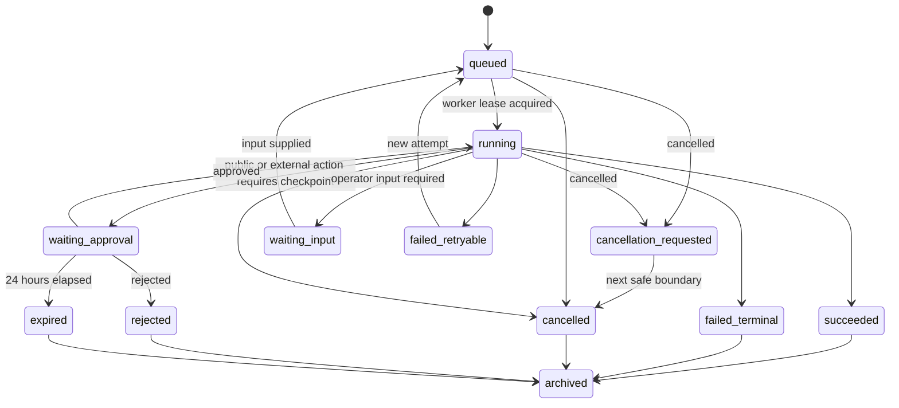

# Agent Task Center Workflow

## Purpose

Task Center is the durable control plane for AI Support work. It records a
complete, append-only execution trace for Widget answers, knowledge-source
syncs, backend operations, approvals, and human-support replies.

The primary readers are tenant administrators and operations staff. Visitors
only receive the final answer, citations, visible progress, and approved human
support replies.

## Task Types

All of the following create an `agent_task` and share the same lifecycle:

- Widget question answering.
- Firecrawl and Context.dev knowledge-source syncs.
- Codex or Hermes backend operations.
- Human approval and human-support reply work.

## Creation And Execution

Events create tasks immediately for Widget messages, manual syncs, and
configuration changes. The scheduler creates tasks for due syncs and health
checks. A background worker claims queued work through a lease; a lease must be
renewed while the task runs and prevents duplicate execution.

Each retry creates a new task attempt linked to its predecessor. Historical
events and task attempts are immutable.

Only five principals may create or advance a task: `human_session`,
`widget_visitor_session`, `agent_bearer_token`, `scheduler`, and `worker`.
Every event records its actor, tenant and chatbot scope, authorization version,
and correlated request ID.

Every task creation path is idempotent. Widget messages use
`conversationId + clientMessageId`; manual and Agent calls use a caller-supplied
`idempotencyKey`; scheduled jobs use `scheduleId + dueAt`. A duplicate request
returns the existing task and must not cause another execution.

## State Machine

Only transient errors are retryable: network timeouts, HTTP 429, HTTP 5xx, and
worker interruptions. The worker retries at most five times with jittered
backoff of 1, 5, 15, 60, and 240 minutes. Authentication failures, missing
permissions, invalid URLs/files, and policy denials are terminal.

Cancellation is cooperative. The task first enters
`cancellation_requested`; the worker stops additional tool calls at the next
safe boundary, releases its lease, and records `cancelled`. Submitted external
actions are not automatically rolled back; the trace labels them as already
occurred and not rolled back. A compensating action is a new task and follows
the normal checkpoint rules.

## Checkpoints

Only work that changes the external world or public content requires a
checkpoint. Retrieval, question answering, drafting, classification, crawling,
syncing, and planning run automatically and remain traceable.

A checkpoint expires after 24 hours. Expiry never executes the pending action.
Any later retry creates a new attempt and requires a fresh approval. No control
can force a task to succeed or replay an action that already had an external
effect.

A checkpoint is assigned to the chatbot owner; if none exists, it enters the
tenant administrator queue. Creating, retrying, failing, waiting for approval,
approaching expiry (one hour remaining), and completing a task creates a Task
Center notification. Email and webhooks are reminder-only and never contain raw
customer content.

## Task Center Controls

Tenant administrators and authorized operations staff may:

- Cancel queued or running tasks.
- Retry retryable failed tasks by creating a new attempt.
- Approve or reject checkpoints when their role permits it.
- Supply input to a `waiting_input` task.
- Archive completed terminal tasks.

They may not edit historical events, force completion, or directly replay a
previous external side effect.

Tenant administrators can view all tenant tasks and authorized raw evidence,
and can perform all permitted controls. Operations staff can act only on
assigned or authorized chatbot tasks. They can view summaries and necessary raw
evidence and can cancel, retry, or supply input. By default, they cannot approve
public, outbound, or high-risk actions.

An `agent_bearer_token` is bound to one tenant and an optional chatbot scope and
must support expiry, revocation, and least-privilege capability scopes. Agent
writes always create a task and trace events. Side-effect capabilities such as
`publish`, `delete`, and `reply.send` may only create a checkpoint; they cannot
execute directly.

## Trace And Artifacts

`agent_task_event` is append-only and stores safe, structured summaries for
lifecycle, planning, tool calls, retrieval, guardrails, checkpoints, outputs,
and termination. The trace must not store model chain-of-thought.

Persist only final answers, structured summaries, citations, tool-decision
summaries, error summaries, and approval rationales. Do not persist token-level
streams or chain-of-thought. The Widget may stream the final answer to a visitor,
while Task Center stores only the completed output and its safe summary.

`agent_task_artifact` stores only metadata, content hashes, access scope,
retention data, and an object reference to the existing storage abstraction.
Large text, crawl snapshots, exports, customer snapshots, and raw tool input or
output are encrypted objects in storage.

Safe summaries, task status, plans, approvals, and artifact indexes are retained
for 180 days. Encrypted raw tool input/output, customer snapshots, and crawled
source content are retained for 30 days, then deleted or archived according to
the applicable compliance policy. Task Center defaults to summaries; raw data is
expanded only after a permission check.

The system creates an administrator notification and a reminder-only webhook
when one chatbot has three terminal failures within ten minutes, a lease is not
renewed for more than two minutes, or a checkpoint has one hour remaining.
Every alert is also an append-only Task Center event.

## Widget Completion Contract

The Widget waits synchronously for up to eight seconds. When the answer is
ready inside that budget, it is returned directly.

When the budget expires, the server persists the task and returns a short-lived
`taskId` and `pollToken` bound to the chatbot, conversation, and visitor
session. The Widget displays an in-progress state and polls the same conversation
every two seconds for at most five minutes. Completion writes the final answer
or escalation state into the conversation before it is returned. Expired tokens,
conversation mismatches, and cross-chatbot access are rejected.

## Completion Criteria

- A single Task Center can filter and inspect every task type and task attempt.
- A running task has one active lease and an append-only event trail.
- Every external or public action is blocked by a persisted checkpoint.
- Retryable and terminal failures follow the declared policy.
- Widget timeout preserves the task trace and returns the final result in the
  originating conversation.
- Retention jobs delete or archive raw evidence independently of task summaries.
